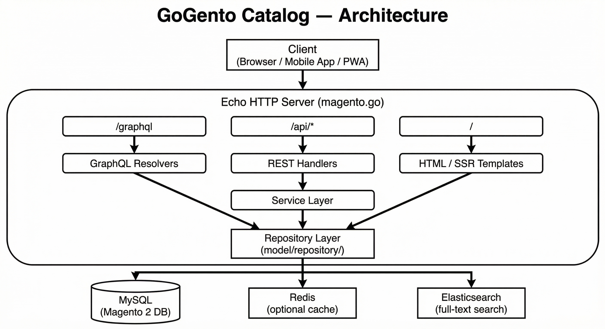

# GoGento Catalog — Magento GraphQL & REST API in Go

Magento 2 API and Frontend in Go — HTML server side rendering, GraphQL and REST, one binary, no slow PHP.

## The world’s fastest framework for building e-Commerce MAGENTO websites!


**GoGento Catalog** connects your Magento 2 database to modern frontends via Echo and GORM. Single binary, ~300+ req/s on a single CPU, sub-30ms for 100 products with 100 EAV attributes. EAV flattening, stock, prices, categories. Concurrent-safe cache, extensible registry, standalone GraphQL mode. Works with Venia, React, Next.js, Vue.

**Why GoGento?** If you run Magento 2 and want a fast, headless API without PHP — deploy one binary, point it at your MySQL, and serve catalog data to PWA, mobile apps, or third-party integrations. No Magento runtime, no Composer, no PHP-FPM. Lower memory, faster cold starts, simpler ops. Use your existing Magento DB schema; products, categories, EAV attributes, stock, and prices flow through unchanged.

## Architecture



**Architecture.** Repository layer for DB access, service layer for logic, API handlers for HTTP. GraphQL schema matches Magento/Venia conventions so frontends built for Magento GraphQL work with minimal changes. REST flat endpoints return products with attributes as keys. Optional global in-memory cache for hot paths; disable with `PRODUCT_FLAT_CACHE=off` for direct DB. Cron jobs for background tasks. Extensible registry for custom resolvers and fields.

**Deployment.** Run full API (REST + GraphQL) or standalone GraphQL server. Single executable, config via env vars. systemd, Docker, or bare metal. No separate app server. Scale horizontally by running more instances behind a load balancer.

## Environment Variables
Set these in a `.env` file or your environment:
```
MYSQL_USER=magento
MYSQL_PASS=magento
MYSQL_HOST=localhost
MYSQL_PORT=3306
MYSQL_DB=magento
API_USER=admin
API_PASS=secret
REDIS_ADDR=""
REDIS_PASS=""
PORT=8080
```

## Features

| Feature | Description | Doc |
|---------|-------------|-----|
| **GraphQL API** | Products, categories, search; Magento/Venia-compatible schema. Store header, pagination, filters. | [graphql.md](doc/graphql.md) |
| **REST API** | Flat products (EAV as keys), orders CRUD. Basic auth. Optional store ID. | [rest-api.md](doc/rest-api.md) |
| **Standalone GraphQL** | Run GraphQL only: `go run ./cmd/graphql`. No REST, smaller footprint. | [installation.md](doc/installation.md) |
| **EAV flattening** | Attributes as keys, stock_item, index_prices. FetchWithAllAttributesFlat. | [eav-products.md](doc/eav-products.md) |
| **Global cache** | In-memory, concurrent-safe. ~300 req/s. Set `PRODUCT_FLAT_CACHE=off` to bypass. | [cache.md](doc/cache.md) |
| **Registry & cache** | Global cache, registry, singleton repos. Per-request isolation. | [registry.md](doc/registry.md) |
| **Product Import** | Magmi alternative. Bulk CSV import with parallel EAV writes. ~127k products/min. | [rest-api.md](doc/rest-api.md) |
| **Cron jobs** | Scheduled and on-demand. `go run cli.go cron:start --job Name`. | [cron.md](doc/cron.md) |
| **Extending** | Add entities, custom resolvers, GraphQL extensions. Tailwind. | [extending.md](doc/extending.md) |

## Quick Start

```bash
cd gogento-catalog
go mod tidy
go run magento.go
```

- **GraphQL:** `POST http://localhost:8080/graphql`
- **Playground:** `GET http://localhost:8080/playground`

```bash
curl -X POST http://localhost:8080/graphql \
  -H "Content-Type: application/json" \
  -H "Store: 1" \
  -d '{"query":"query { products { total_count } }"}'
```

## Documentation

[Technical index](doc/technical.md) · [Installation](doc/installation.md) · [Production](doc/production.md)

## Product Import — Magmi Alternative in Go

GoGento includes a high-performance bulk product importer — a Go-native replacement for [Magmi](https://github.com/dweeves/magmi-mirror). It reads CSV files and writes directly to Magento's EAV tables using parallel bulk upserts, bypassing PHP entirely.

### Why not Magmi?

Magmi is a PHP-based direct-SQL importer that was fast for its era but has limitations:

- **PHP memory ceiling** — large catalogs (50k+ products) hit memory limits or require careful tuning
- **Single-threaded** — one EAV type at a time, no parallel DB writes
- **Unmaintained** — last meaningful update years ago, no Magento 2.4+ testing
- **No API mode** — CLI only, no REST endpoint for programmatic imports

GoGento's importer solves all of these:

- **Parallel DB writes** — EAV (varchar, int, decimal, text, datetime), stock, gallery, and price tables are flushed concurrently via goroutines
- **Constant memory** — streaming CSV parse + fixed batch buffers, memory doesn't grow with file size
- **Raw SQL mode** — optional `--raw-sql` flag bypasses ORM overhead for maximum throughput
- **Dual interface** — CLI (`products:import`) for files, REST API (`POST /api/stock/import`) for programmatic use
- **Single binary** — no PHP, no Composer, no JVM; deploy and run

### Benchmark: 100,000 Products

Each product has 50 EAV attributes (20 varchar, 10 int, 10 decimal, 5 text, 5 datetime).

| Metric | Value |
|--------|-------|
| Products imported | 100,000 |
| EAV rows upserted | 5,000,000 |
| Total time | ~47 seconds |
| **Throughput** | **~2,100 products/sec** |
| **Throughput** | **~127,000 products/min** |
| EAV row rate | ~106,000 rows/sec |

> Tested with SQLite (in-memory). Real MySQL/MariaDB performance will vary depending on disk I/O, indexes, and connection pool settings — but the Go-side processing overhead is minimal.

### Usage

```bash
# Import from CSV (raw SQL, batch 1000)
gogento products:import -f products.csv --raw-sql --batch-size 1000

# Stock import via API
curl -X POST http://localhost:8080/api/stock/import \
  -H "Authorization: Bearer your-token" \
  -H "Content-Type: application/json" \
  -d '{"items": [{"sku": "SKU-001", "qty": 100, "is_in_stock": 1}]}'
```

See [rest-api.md](doc/rest-api.md) for full CSV format, API request/response, and all available flags.

## Performance

- **With cache:** ~300 req/s, ~1 ms single product (ApacheBench)
- **100 products, 100 attrs:** REST ~25 ms, GraphQL ~30 ms (`make test-perf`)
- **Product import:** ~127,000 products/min (100k products, 50 attrs each, raw SQL)
- No N+1: batch Preload with IN clauses

## Environment

```bash
MYSQL_USER=magento MYSQL_PASS=magento MYSQL_HOST=localhost MYSQL_DB=magento
API_USER=admin API_PASS=secret PORT=8080
```

## Tests

```bash
make test      # All tests
make test-perf # GraphQL vs REST benchmark
```
