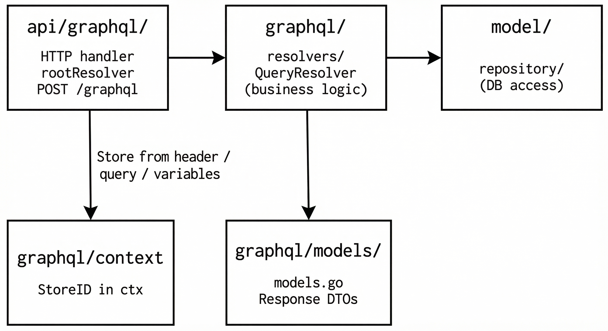
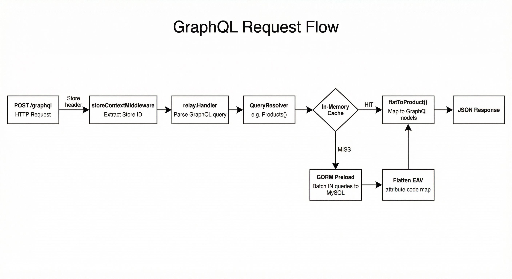

# GraphQL API — Architecture & Conventions

## Overview

GoGento uses [graph-gophers/graphql-go](https://github.com/graph-gophers/graphql-go) with an embedded schema. Store context is passed via headers, query params, or variables.

## Architecture



### Layers

| Layer | Path | Role |
|-------|------|------|
| **HTTP** | `api/graphql/graphql_api.go` | Parses request, extracts Store, wires rootResolver, relay handler |
| **Schema** | `graphql/schema.graphqls` | GraphQL types and Query definition (extensible via `RegisterSchemaExtension`) |
| **Schema + Args** | `graphql/schema.go` | Embeds schema, extensions, and shared arg types |
| **Registry** | `graphql/registry/` | Dynamic resolver registration for `_extension` + QueryResolverFactory |
| **Resolvers** | `graphql/resolvers/` | QueryResolver methods — fetches data, maps to gqlmodels |
| **Models** | `graphql/models/models.go` | All response DTOs (import as `gqlmodels`) |
| **Custom** | `custom/` | Packages that register via `gqlregistry.Register` in `init()` |
| **Repository** | `model/repository/` | DB access |

### File Map

```
api/graphql/graphql_api.go          # HTTP routes, rootResolver, store middleware
graphql/schema.graphqls             # GraphQL SDL
graphql/schema.go                   # Embeds schema + extensions + arg types
graphql/context.go                  # StoreID context helpers
graphql/registry/registry.go        # _extension registry + QueryResolverFactory
graphql/models/models.go            # All DTOs (Product, Category, Magento types)
graphql/resolvers/resolver.go       # QueryResolver struct, init(), helpers, Extension
graphql/resolvers/product.go        # Products / Product resolvers
graphql/resolvers/product_mapper.go # flatToProduct, decode hooks
graphql/resolvers/category.go       # Category resolvers + mappers
graphql/resolvers/search.go         # Search resolver (Elasticsearch)
graphql/resolvers/magento_resolver.go # Magento-compat resolvers + helpers
```

## Conventions

1. **Import alias:** Use `gqlmodels "magento.GO/graphql/models"` to distinguish from domain models.
2. **Store context:** Resolvers get `StoreID` via `r.storeID(ctx)` (calls `graphql.StoreIDFromContext`).
3. **Resolver pattern:** All Query methods live directly on `QueryResolver` — no delegation layers.
4. **Dependencies:** `QueryResolver` holds `*gorm.DB`; access repos via `r.productRepo()`, `r.categoryRepo()`.
5. **Naming:** Schema fields use `camelCase`; Go structs use `PascalCase`; graphql-go maps automatically.

## How to Add a New GraphQL Endpoint

### Example: Add `featuredProducts(limit: Int): [Product!]!`

#### 1. Schema — `graphql/schema.graphqls`

```graphql
type Query {
  # ... existing fields ...
  featuredProducts(limit: Int = 5): [Product!]!
}
```

#### 2. Resolver — `graphql/resolvers/product.go` (or new file)

```go
func (r *QueryResolver) FeaturedProducts(ctx context.Context, args struct {
	Limit *int32
}) ([]*gqlmodels.Product, error) {
	n := 5
	if args.Limit != nil && *args.Limit > 0 {
		n = int(*args.Limit)
	}
	flat, err := r.productRepo().FetchWithAllAttributesFlat(r.storeID(ctx))
	if err != nil {
		return nil, err
	}
	items := filterProductsForGuest(flat, guestGroupID)
	if len(items) > n {
		items = items[:n]
	}
	result := make([]*gqlmodels.Product, len(items))
	for i, p := range items {
		result[i] = flatToProduct(p)
	}
	return result, nil
}
```

#### 3. Mock (for tests) — `tests/graphql/mock_resolvers.go`

```go
func (m *MockQueryResolver) FeaturedProducts(ctx context.Context, args struct {
	Limit *int32
}) ([]*gqlmodels.Product, error) {
	name := "Featured"
	price := 49.99
	return []*gqlmodels.Product{{EntityID: "1", SKU: "FEAT-1", Name: &name, Price: &price}}, nil
}
```

#### 4. Test

```bash
curl -X POST http://localhost:8080/graphql \
  -H "Content-Type: application/json" \
  -H "Store: 1" \
  -d '{"query":"query { featuredProducts(limit: 3) { sku name } }"}'
```

That's it — 2 steps (schema + method). No interfaces, no server wiring, no factories.

## Request Flow



## Store Resolution

Store ID is resolved in order:

1. **Header:** `Store: 1`
2. **Query param:** `?__Store=1`
3. **Variables:** `{"variables": {"__Store": "1"}}`

## Extensible Resolvers (No Core Changes)

Add new GraphQL resolvers **without modifying core** via `_extension` and the registry.

1. **Register** your resolver in `init()` (e.g. in `custom/`):
2. **Call** it via `_extension(name: "yourName", args: "{}")`

```go
package custom

import (
	"context"

	gqlregistry "magento.GO/graphql/registry"
)

func init() {
	gqlregistry.Register("ping", func(ctx context.Context, args map[string]interface{}) (interface{}, error) {
		return map[string]string{"pong": "ok"}, nil
	})
}
```

**Call via GraphQL:**

```graphql
query { _extension(name: "ping", args: "{}") }
```

Returns JSON string. `args` is optional; pass `"{}"` or omit for no arguments. Add packages under `custom/` and import `_ "magento.GO/custom"` in `api/graphql`.

## Extensible Schema

The schema is built from `graphql/schema.graphqls` plus registered extensions. Custom packages can add Query fields:

```go
import "magento.GO/graphql"

func init() {
	graphql.RegisterSchemaExtension(`
		extend type Query {
			featuredProducts(limit: Int = 5): [Product!]!
		}
	`)
}
```

You must also add a matching method on `QueryResolver`. The base schema is the single source of truth; extensions append to it.

## Available Queries

| Query | Description |
|-------|-------------|
| `products` | Paginated products (pageSize, currentPage, skus, categoryId) |
| `product` | Single product by sku or url_key |
| `categories` | All categories |
| `category` | Category by id |
| `categoryTree` | Category tree |
| `magentoCategories` | Magento/Venia format, filter by category_uid |
| `magentoProducts` | Magento/Venia format, filter/sort by category |
| `search` | Elasticsearch full-text search |
| `_extension` | Call registered custom resolver by name (args: JSON string) |

## Custom Registries (cmd, cron, routes)

Same pattern as GraphQL extensions: add packages under `custom/` that call registry `Register` in `init()`.

| Registry | Key | Register | Apply |
|----------|-----|----------|-------|
| **Commands** | `registry:cmd` | `cmd.Register(&cobra.Command{...})` | — |
| **Cron jobs** | `registry:cron` | `cron.Register("name", "@every 1h", fn)` | — |
| **API modules** (`/api/*`, auth) | `registry:api` | `api.RegisterModule(func(g, db))` | `api.ApplyModules(apiGroup, db)` |
| **Root routes** (public) | `registry:routes` | `api.RegisterRoute(func(e, db))` | `api.ApplyRoutes(e, db)` |

Shorthands for root routes: `api.RegisterGET("/path", handler)`, `api.RegisterHTMLModule(fn)`.

Import `_ "magento.GO/custom"` in `cli.go` (for cmd/cron) and in `api/graphql` (for routes, via custom). API packages self-register via `init()` — see `api/product/`, `api/category/`, `api/sales/`, `html/`.

## References

- [graph-gophers/graphql-go](https://github.com/graph-gophers/graphql-go)
- [README-GRAPHQL.md](../README-GRAPHQL.md) — Usage, store, search, env vars
