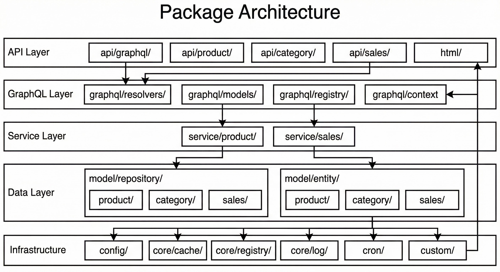

# Technical Documentation

Reference by feature.

## Directory Structure

```
magento.GO/
  main.go
  api/          # REST & GraphQL handlers
  graphql/      # Schema, resolvers, models, registry
  custom/       # Extensions (gqlregistry.Register)
  model/
    entity/     # GORM models
    repository/ # DB access
  service/      # Business logic
  config/
  cron/         # Scheduled jobs
  cmd/          # CLI (graphql, cron)
```

## Documentation by Feature

| Feature | Doc |
|---------|-----|
| Installation, running | [installation.md](installation.md) |
| REST API, endpoints | [rest-api.md](rest-api.md) |
| GraphQL | [graphql.md](graphql.md) |
| EAV products, flattening | [eav-products.md](eav-products.md) |
| Cache, performance | [cache.md](cache.md) |
| Global cache & registry | [registry.md](registry.md) |
| Cron jobs | [cron.md](cron.md) |
| Production, daemon | [production.md](production.md) |
| Extending | [extending.md](extending.md) |

## Architecture



- **Entity** (`model/entity/`): GORM structs
- **Repository** (`model/repository/`): CRUD, queries
- **Service** (`service/`): Business logic
- **API** (`api/`): HTTP handlers
